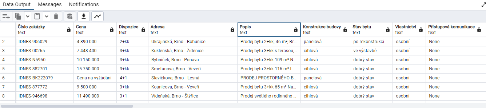

 # Vítejte v aplikaci "idnes-real-estate-scraper"

 ## O aplikaci

Tato asynchronní aplikace slouží k efektivnímu scrapování údajů o nemovitostech (např. cena, dispozice, plocha) z realitního portálu https://reality.idnes.cz/. Získaná data jsou následně ukládána do databáze PostgreSQL.

 ## Omezení

Aby nedocházelo k nadměrnému zatěžování webu https://reality.idnes.cz/, neposkytuji zde soubor selector.py, který obsahuje klíčové selektory pro scrapování dat – bez něj aplikace nefunguje.

Pokud máš o tento soubor zájem, napiš mi a po domluvě ti ho mohu poskytnout.